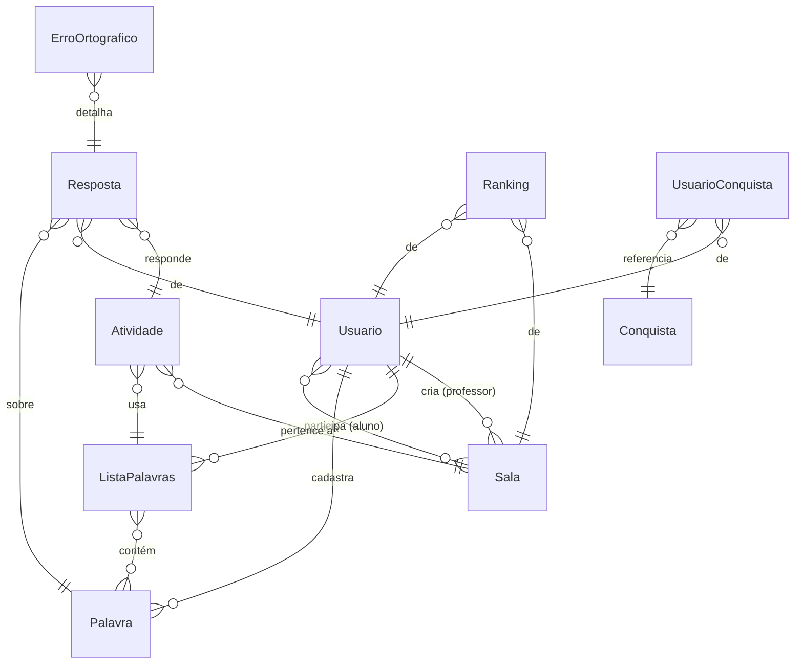

<div align="center">

# DIGITADO

**Plataforma gamificada de ditado ortográfico em tempo real.**
Ouça a palavra, escreva a grafia correta, ganhe XP e suba no ranking: sozinho, em duelo 1v1 ou numa sala com a turma inteira.

[](https://openjdk.org/)
[](https://spring.io/projects/spring-boot)
[](https://www.jhipster.tech/)
[](https://react.dev/)
[](https://www.mysql.com/)

</div>

---

## Índice

- [Sobre o projeto](#sobre-o-projeto)
- [Funcionalidades](#funcionalidades)
- [Como funciona uma partida](#como-funciona-uma-partida)
- [Stack tecnológica](#stack-tecnológica)
- [Modelo de domínio](#modelo-de-domínio)
- [Segurança](#segurança)
- [Guia passo a passo (do zero até rodar)](#guia-passo-a-passo-do-zero-até-rodar)
- [Configuração](#configuração)
- [API](#api)
- [Build de produção](#build-de-produção)
- [Testes](#testes)
- [Estrutura do projeto](#estrutura-do-projeto)
- [Problemas comuns](#problemas-comuns)
- [Monitoramento](#monitoramento)
- [LGPD](#lgpd)
- [Contribuindo](#contribuindo)

## Sobre o projeto

O **DIGITADO** é uma aplicação web full-stack pensada para o contexto escolar. Um professor cria salas de jogo, os alunos entram por um código e, em tempo real, disputam quem escreve as palavras ditadas de forma correta e mais rápida. Cada acerto rende pontos e XP, desbloqueia conquistas e movimenta o ranking mundial.

O sistema nasceu de um modelo de domínio em [JDL](DIGITADO.jdl) e foi gerado com **JHipster**, combinando um backend **Spring Boot** com um frontend **React**. A comunicação das partidas acontece por **WebSocket (STOMP/SockJS)**, garantindo placar e feedback instantâneos.

## Funcionalidades

| Recurso                 | Descrição                                                                                                                                                       |
| ----------------------- | --------------------------------------------------------------------------------------------------------------------------------------------------------------- |
| **Salas em tempo real** | O professor cria uma sala, compartilha o código, e os alunos entram e jogam juntos. Palavras avançam automaticamente com tempo por dificuldade; placar ao vivo. |
| **Duelo 1v1**           | Desafio direto entre dois jogadores. Quem cria a sala também joga e comanda o avanço das rodadas.                                                               |
| **Palavra do Dia**      | Desafio público diário com uma chance por pessoa (controle no servidor por conta ou cookie). Acertar rende XP.                                                  |
| **Ranking mundial**     | Os melhores jogadores por XP acumulado, com destaque para o top 5 na home.                                                                                      |
| **Conquistas**          | Medalhas desbloqueadas conforme o desempenho, com recompensa de XP.                                                                                             |
| **Ditado por áudio**    | A palavra é falada via síntese de voz do navegador; o texto nunca aparece na tela do aluno.                                                                     |
| **Campo anti-cola**     | O input bloqueia colar, arrastar, autocompletar e correção ortográfica. Só a digitação real (física ou teclado virtual) é aceita.                               |
| **Correção detalhada**  | O erro é classificado (acentuação, fonético, letra trocada/extra/faltando) em vez de virar um simples "errou".                                                  |
| **Relatório da turma**  | Ao fim da partida o professor vê, palavra por palavra, o que cada aluno digitou e a taxa de acerto.                                                             |
| **Banco de palavras**   | Palavras por dificuldade, categoria e dica, com sugestões enviadas pelos jogadores.                                                                             |
| **LGPD**                | O titular pode exportar e excluir seus dados; há rotina de retenção automática.                                                                                 |
| **Observabilidade**     | Métricas Prometheus, dashboards Grafana e alertas. Ver [MONITORING.md](MONITORING.md).                                                                          |

## Como funciona uma partida

```
professor                          servidor                          alunos
   │                                  │                                 │
   ├─ cria a sala ───────────────────▶ gera o código (ex: 8H4XEZ)       │
   │                                  │                                 │
   │                        ◀───────── entram com o código ─────────────┤
   ├─ inicia ────────────────────────▶ sorteia as palavras da lista      │
   │                                  ├─ broadcast /topic: nova palavra ▶│  fala o áudio
   │                                  │                                 │
   │                        ◀───────── resposta digitada ───────────────┤
   │                                  ├─ valida no servidor, pontua     │
   │                                  ├─ /queue: feedback individual ──▶│
   │                                  ├─ /topic: placar atualizado ────▶│
   │                                  │                                 │
   ├─ encerra ───────────────────────▶ pódio + relatório por palavra     │
```

Pontos importantes do desenho:

- **A validação é sempre no servidor.** O cliente nunca recebe o texto da palavra, apenas o áudio sintetizado, então não há como ler a resposta no DOM.
- **O tempo da rodada depende da dificuldade** e o servidor aceita respostas com uma folga de rede de 2s após o fim.
- **Respostas absurdamente rápidas são descartadas** (abaixo de ~80ms por letra ninguém digita de verdade).
- **O estado da partida vive em memória**, por sala. Reiniciar o servidor encerra os jogos em andamento; o histórico persistido (respostas, ranking, XP) permanece no banco.

## Stack tecnológica

**Backend**

- Java 17 · Spring Boot 3.4.7 · Spring Security (JWT / OAuth2 Resource Server)
- Spring WebSocket + STOMP (broker simples `/topic` e `/queue`)
- Spring Data JPA · MySQL 9.2 · Liquibase (versionamento de schema)
- Rate limiting e Request-ID por filtros próprios

**Frontend**

- React 18 · TypeScript · React Router 7 · Redux Toolkit
- `@stomp/stompjs` + `sockjs-client` (tempo real) · Axios
- Bootstrap 5 / Reactstrap · Webpack

**Infra & Qualidade**

- Docker Compose (app + serviços) · Prometheus / Grafana / Alertmanager
- SonarQube · ESLint · Prettier · Husky (pre-commit) · Jest · JUnit + Testcontainers

## Modelo de domínio



O modelo completo, incluindo enums (`Dificuldade`, `TipoUsuario`, `StatusAtividade`, `TipoErro`…), está em [`DIGITADO.jdl`](DIGITADO.jdl).

## Segurança

Autenticação por **JWT** (stateless), com autorização baseada em papéis: `ROLE_ADMIN`, `ROLE_USER` e `ROLE_ANONYMOUS`.

- **Manipulação do banco restrita ao ADMIN.** As escritas (`POST`/`PUT`/`PATCH`/`DELETE`) das entidades administrativas (`atividades`, `palavras`, `conquistas`, `rankings`, `respostas`, `lista-palavras`, `erro-ortograficos`, `usuarios` e `usuario-conquistas`) exigem `ROLE_ADMIN`.
- **Endpoints de jogo** permanecem acessíveis a qualquer usuário autenticado: `palavras/sugerir`, `usuarios/alterar-senha`, `salas/**`, `conquistas/minhas`.
- **Endpoints públicos:** `palavra-do-dia`, `ranking-mundial`, registro e recuperação de senha.
- **Cadastro sem confirmação por e-mail.** A conta nasce ativa e o usuário já pode entrar; nenhum e-mail de ativação é enviado. O endpoint `GET /api/activate` continua existindo para contas antigas que tenham chave pendente.
- **Defesa em profundidade:** rate limiting configurável, `Request-Id` para rastreabilidade, validação server-side do ditado e das chances diárias, e handshake WebSocket autenticado por JWT.

As regras ficam em [`SecurityConfiguration.java`](src/main/java/br/com/digitado/config/SecurityConfiguration.java).

---

## Guia passo a passo (do zero até rodar)

Este guia parte de uma máquina sem nada instalado e termina com o back-end e o front-end rodando. Os comandos são mostrados para **Windows (PowerShell)** e, quando diferentes, para **macOS/Linux**.

### Passo 1 - Instalar as ferramentas de base

Você precisa de quatro coisas: **Git**, **JDK 17**, **Node.js (que traz o npm)** e um **MySQL** (ou Docker).

> **Atalho no Windows:** o script [`setup-ambiente.ps1`](setup-ambiente.ps1) faz os passos 1, 3 e 4 sozinho - instala o JDK se necessário, configura o `JAVA_HOME`, sobe o banco, libera as portas 8080 e 9000 no firewall (perfil _Private_, para acesso pela rede local) e instala as dependências. Rode-o em um PowerShell **como administrador**, depois de clonar o projeto (Passo 2):
>
> ```bash
> powershell -ExecutionPolicy Bypass -File .\setup-ambiente.ps1
> ```
>
> Use `-Simular` para só ver o que ele faria, sem alterar nada. Ao final ele imprime `TUDO FUNCIONOU` ou a lista do que falhou.

#### Levando o projeto sem o GitHub (pendrive)

Para instalar em outra máquina copiando por pendrive, em vez de clonar:

1. **Na máquina de origem**, um único comando exporta o banco e copia o projeto (troque `E:` pela letra do pendrive):

   ```bash
   powershell -ExecutionPolicy Bypass -File .\copiar-para-pendrive.ps1 -Destino E:\
   ```

   O prefixo `powershell -ExecutionPolicy Bypass -File` é necessário porque o Windows bloqueia a execução de scripts `.ps1` por padrão. Ele vale só para aquela execução, sem alterar a configuração da máquina.

   O [`copiar-para-pendrive.ps1`](copiar-para-pendrive.ps1) chama o [`exportar-banco.ps1`](exportar-banco.ps1), que grava `dados\banco-digitado.sql` com estrutura e dados (palavras, listas, conquistas, contas), e em seguida copia o necessário - cerca de 6 MB - deixando de fora `node_modules` e `target`, que a outra máquina regenera. Use `-SemBanco` para copiar sem reexportar, ou `-Simular` para só ver o que seria feito.

2. **Na máquina de destino**, copie a pasta do pendrive para o disco (não rode direto do pendrive) e execute o `setup-ambiente.ps1` como administrador. Ele restaura o dump automaticamente, desde que o banco de destino esteja vazio - se já houver tabelas, os dados existentes são preservados e a restauração é pulada (use `-ForcarImportacao` para sobrescrever).

> O arquivo `dados\banco-digitado.sql` contém e-mails e hashes de senha, por isso está no `.gitignore`: ele viaja no pendrive, nunca no repositório.

#### A semente do banco (para quem clonou do GitHub)

Quem chega pelo `git clone` não tem o dump do pendrive, e um banco vazio deixa o projeto sem graça: sem palavras, não há o que ditar. Por isso o repositório traz `dados/seed-digitado.sql`, com as **305 palavras**, as 10 listas, as 39 conquistas e as contas padrão `admin` e `user`. Nenhum dado de usuário real entra nele.

Os dois caminhos de instalação usam a semente sozinhos: tanto o `setup-ambiente.ps1` quanto o `iniciar-container.ps1` procuram primeiro o `dados\banco-digitado.sql` e, se ele não existir, caem na semente. Não há passo extra.

Depois de cadastrar palavras novas e querer atualizar a semente publicada, use o [`sanitizar-banco.ps1`](sanitizar-banco.ps1):

```bash
powershell -ExecutionPolicy Bypass -File .\sanitizar-banco.ps1
```

Ele importa o seu dump pessoal em um MySQL descartável, apaga usuários, salas, respostas e ranking, e grava o resultado em `dados/seed-digitado.sql`. O banco de desenvolvimento da sua máquina não é tocado, e o script se recusa a terminar se sobrar algum e-mail na saída.

#### Tudo em container (sem instalar Java nem Node)

Alternativa ao `setup-ambiente.ps1` para quando a outra máquina só pode ter o Docker. O [`Dockerfile`](Dockerfile) compila back-end e front-end, e o [`docker-compose.yml`](docker-compose.yml) sobe a aplicação junto com um MySQL já carregado com `dados\banco-digitado.sql`:

```bash
powershell -ExecutionPolicy Bypass -File .\iniciar-container.ps1
```

Não pede administrador e não instala nada na máquina - nem JDK, nem Node, nem regra de firewall (o Docker publica a porta 8080 sozinho). Como o perfil `prod` embute o front-end no `.jar`, não existe segundo terminal: tudo responde em <http://localhost:8080>.

Na primeira execução o script grava um `.env` (fora do git) com as senhas do banco e a chave JWT daquela máquina. Depois disso: `-Reconstruir` recompila a imagem a partir do código atual **preservando** o banco, `-Parar` desliga os containers e `-Limpar` apaga o banco do container para a próxima subida recomeçar do dump.

#### 1.1. Git

- Windows: baixe em <https://git-scm.com/download/win> e instale (avance com "Next" e conclua com "Finish").
- macOS: `brew install git` · Linux (Debian/Ubuntu): `sudo apt install git`

Verifique:

```bash
git --version
```

#### 1.2. JDK 17

Baixe o **Java 17** (Temurin/Adoptium é uma boa opção): <https://adoptium.net/temurin/releases/?version=17>. Instale e confirme:

```bash
java -version
```

A saída deve mostrar `17.x`. O projeto compila para Java 17, mas o `maven-enforcer-plugin` aceita **17, 21 ou 24** - apenas essas. Um JDK 20 ou 23, por exemplo, é recusado com a mensagem `You are running an incompatible version of Java`, mesmo estando dentro da faixa citada no erro.

Se aparecer outra versão, aponte o `JAVA_HOME` para um JDK aceito. No Windows, o instalador da Oracle costuma colocar `C:\Program Files\Common Files\Oracle\Java\javapath` no **início** do `Path` do sistema, e é ele que vence - nesse caso, mova `%JAVA_HOME%\bin` para cima dessa entrada em _Variáveis de Ambiente → Variáveis do sistema → Path_. Confira qual está sendo usado com:

```bash
where java
```

O Maven não usa necessariamente o mesmo `java` do `Path`: ele segue o `JAVA_HOME`. Para ver o que a build enxerga, rode `.\mvnw.cmd --version` (Windows) ou `./mvnw --version`.

#### 1.3. Node.js e npm

O **npm** já vem junto com o Node.js: instalar o Node instala o npm. Use a versão **22 LTS** (a testada no projeto é a `v22.15.0`).

- **Windows/macOS:** baixe o instalador LTS em <https://nodejs.org/> e execute.
- **macOS (Homebrew):** `brew install node@22`
- **Linux/macOS (recomendado, com nvm):**
  ```bash
  curl -o- https://raw.githubusercontent.com/nvm-sh/nvm/v0.40.1/install.sh | bash
  nvm install 22
  nvm use 22
  ```

Verifique as duas ferramentas:

```bash
node -v
npm -v
```

> Observação: o projeto também traz o wrapper `npmw`, que baixa e fixa a versão correta do npm automaticamente. Ainda assim, ter o Node instalado globalmente torna o passo a passo mais simples.

#### 1.4. MySQL (ou Docker)

Você tem duas opções, escolha **uma**.

- **Opção A (mais fácil): Docker.** Instale o [Docker Desktop](https://www.docker.com/products/docker-desktop/). Não precisa instalar MySQL à mão; um container é subido no Passo 4.
- **Opção B: MySQL local.** Instale o **MySQL 8+** em <https://dev.mysql.com/downloads/installer/> e deixe o serviço rodando na porta padrão `3306`.

### Passo 2 - Obter o código

```bash
git clone https://github.com/davifsrPI/DIGITADO.git
cd DIGITADO
```

### Passo 3 - Instalar as dependências do frontend

Na raiz do projeto, baixe as dependências do npm (só é necessário na primeira vez e sempre que o `package.json` mudar):

```bash
npm install
```

Alternativa com o wrapper (fixa a versão do npm):

- Windows (PowerShell): `.\npmw.cmd install`
- macOS/Linux: `./npmw install`

### Passo 4 - Preparar o banco de dados

**Se escolheu Docker (Opção A):** suba o MySQL em container. O Docker Desktop precisa estar **aberto e rodando**:

```bash
docker compose -f src/main/docker/mysql.yml up -d
```

O container já sobe com o banco `DIGITADO` e as credenciais que o perfil de desenvolvimento espera (`root` / `31415`), então nada mais precisa ser configurado.

**Se escolheu MySQL local (Opção B):** o perfil de desenvolvimento cria o schema `DIGITADO` automaticamente e, por padrão, conecta com usuário `root` / senha `31415` (definido em [`application-dev.yml`](src/main/resources/config/application-dev.yml)). Para usar outras credenciais, defina variáveis de ambiente **antes** de subir o back-end:

- Windows (PowerShell):
  ```powershell
  $env:SPRING_DATASOURCE_USERNAME = "root"
  $env:SPRING_DATASOURCE_PASSWORD = "suaSenha"
  ```
- macOS/Linux:
  ```bash
  export SPRING_DATASOURCE_USERNAME=root
  export SPRING_DATASOURCE_PASSWORD=suaSenha
  ```

### Passo 5 - Rodar o back-end (Spring Boot)

Em um terminal, na raiz do projeto:

- Windows (PowerShell): `.\mvnw.cmd`
- macOS/Linux: `./mvnw`

Na primeira execução o Maven baixa as dependências (pode levar alguns minutos). O back-end está pronto quando aparecer no log:

```
Application 'DIGITADO' is running! Access URLs:
    Local:    http://localhost:8080/
```

Deixe **este terminal aberto**: ele mantém a API rodando na porta **8080**.

### Passo 6 - Rodar o front-end (React)

Abra um **segundo terminal** (sem fechar o do back-end), na raiz do projeto:

- Windows (PowerShell): `.\npmw.cmd start`
- macOS/Linux: `./npmw start` (ou simplesmente `npm start`)

O webpack compila e abre o navegador em **<http://localhost:9000>**, com hot-reload (a página recarrega sozinha ao salvar arquivos). O front-end faz proxy das chamadas `/api` para o back-end na 8080.

### Passo 7 - Acessar e entrar

Abra <http://localhost:9000> e faça login com uma das contas de desenvolvimento já cadastradas:

| Usuário | Senha                      | Papel      |
| ------- | -------------------------- | ---------- |
| `admin` | definida por quem instalou | ROLE_ADMIN |
| `user`  | `user`                     | ROLE_USER  |

> A senha do `admin` não é documentada aqui de propósito: este repositório é público. Ela é aplicada pelo changelog [`20260810120000_senha_admin.xml`](src/main/resources/config/liquibase/changelog/20260810120000_senha_admin.xml) na primeira subida do back-end.

Pronto, você pode criar uma sala, jogar a Palavra do Dia e explorar o ranking.

> Para testar uma sala de verdade, abra uma segunda janela do navegador (ou uma janela anônima), entre como `user` e use o código que apareceu na tela do professor.

### Resumo dos comandos

```bash
# 1. clonar
git clone https://github.com/davifsrPI/DIGITADO.git
cd DIGITADO

# 2. dependências do front
npm install

# 3. banco (via Docker)
docker compose -f src/main/docker/mysql.yml up -d

# 4. back-end (terminal 1)   ->  http://localhost:8080
./mvnw            # Windows: .\mvnw.cmd

# 5. front-end (terminal 2)  ->  http://localhost:9000
npm start         # ou ./npmw start  (Windows: .\npmw.cmd start)
```

---

## Configuração

Em desenvolvimento os valores padrão bastam. Em produção, tudo o que é sensível vem de variáveis de ambiente:

| Variável                                             | Para que serve                                         | Padrão                                 |
| ---------------------------------------------------- | ------------------------------------------------------ | -------------------------------------- |
| `SPRING_DATASOURCE_URL`                              | URL JDBC do MySQL                                      | `jdbc:mysql://localhost:3306/DIGITADO` |
| `SPRING_DATASOURCE_USERNAME`                         | Usuário do banco                                       | `digitado` (prod) / `root` (dev)       |
| `SPRING_DATASOURCE_PASSWORD`                         | Senha do banco                                         | vazio (prod) / `31415` (dev)           |
| `JHIPSTER_SECURITY_AUTHENTICATION_JWT_BASE64_SECRET` | Segredo de assinatura do JWT. **Obrigatório em prod.** | vazio (a aplicação não sobe sem ele)   |
| `APPLICATION_WEBSOCKET_ALLOWED_ORIGINS`              | Origens aceitas no handshake STOMP                     | vazio (só a mesma origem do site)      |

Gere o segredo do JWT com:

```bash
openssl rand -base64 64
```

Outras chaves úteis, em [`application.yml`](src/main/resources/config/application.yml) sob `application.rate-limit`:

| Propriedade               | O que faz                                                        | Padrão  |
| ------------------------- | ---------------------------------------------------------------- | ------- |
| `enabled`                 | Liga/desliga o filtro de rate limit                              | `true`  |
| `requisicoes-por-minuto`  | Teto de chamadas a `/api/**` por identidade (login ou IP)        | `100`   |
| `autenticacao-por-minuto` | Teto mais rígido no login, contra força bruta de senha           | `10`    |
| `confiar-x-forwarded-for` | Só ligue atrás de proxy reverso confiável, senão o IP é forjável | `false` |

A validade do token é de 12h (43200s) e 7 dias com "lembrar de mim".

## API

Os recursos REST seguem o padrão do JHipster (`GET` lista/paginado, `GET /{id}`, `POST`, `PUT /{id}`, `PATCH /{id}`, `DELETE /{id}`):

| Base                                                                                                                             | Conteúdo                                           | Acesso                             |
| -------------------------------------------------------------------------------------------------------------------------------- | -------------------------------------------------- | ---------------------------------- |
| `/api/authenticate`                                                                                                              | Login, devolve o JWT                               | público                            |
| `/api/register`, `/api/account`                                                                                                  | Registro, perfil, troca de senha                   | público / próprio                  |
| `/api/public/palavra-do-dia`                                                                                                     | Desafio do dia e envio da tentativa                | público                            |
| `/api/public/ranking-mundial`                                                                                                    | Ranking por XP acumulado                           | público                            |
| `/api/salas`                                                                                                                     | Criar, listar, entrar, relatório da partida        | autenticado                        |
| `/api/palavras`                                                                                                                  | Banco de palavras (`/sugerir` é aberto ao jogador) | leitura autenticada, escrita ADMIN |
| `/api/conquistas`                                                                                                                | Catálogo (`/minhas` traz as do usuário)            | leitura autenticada, escrita ADMIN |
| `/api/usuarios`                                                                                                                  | Perfis de jogador (`/alterar-senha` é do próprio)  | escrita ADMIN                      |
| `/api/atividades`, `/api/respostas`, `/api/rankings`, `/api/lista-palavras`, `/api/erro-ortograficos`, `/api/usuario-conquistas` | CRUDs administrativos                              | escrita ADMIN                      |
| `/api/admin/**`                                                                                                                  | Gestão de contas e authorities                     | ADMIN                              |

Durante a partida, o que trafega é STOMP sobre WebSocket (prefixo `/app`, autenticado por JWT no handshake):

| Mensagem                       | Quem envia   | Efeito                                         |
| ------------------------------ | ------------ | ---------------------------------------------- |
| `/app/sala/{codigo}/entrar`    | aluno        | Entra no lobby e aparece na lista              |
| `/app/sala/{codigo}/iniciar`   | dono da sala | Sorteia as palavras e começa a primeira rodada |
| `/app/sala/{codigo}/responder` | aluno        | Envia a grafia digitada; o servidor valida     |
| `/app/sala/{codigo}/proxima`   | dono da sala | Avança para a próxima palavra                  |
| `/app/sala/{codigo}/pausar`    | dono da sala | Pausa a rodada                                 |
| `/app/sala/{codigo}/encerrar`  | dono da sala | Fecha a partida e libera o relatório           |

O servidor responde em `/topic/sala/{codigo}` (estado e placar, para todos) e `/queue` (feedback individual). Logado como `admin`, a documentação interativa da API fica em `/admin/docs` (em desenvolvimento, <http://localhost:9000/admin/docs>).

## Build de produção

```bash
./mvnw -Pprod clean verify
```

Gera um jar único com o front-end minificado embutido. Para executar:

```bash
java -jar target/*.jar
```

Acesse <http://localhost:8080>. Em produção, informe o segredo JWT e as credenciais do banco por variáveis de ambiente (ver [Configuração](#configuração)).

## Testes

```bash
# Testes de backend (JUnit + Testcontainers)
./mvnw verify
```

```bash
# Testes de frontend (Jest)
./npmw test
```

Os testes de backend sobem um MySQL em container, então o Docker precisa estar rodando.

## Estrutura do projeto

```
DIGITADO/
├── src/main/java/br/com/digitado/
│   ├── config/            # Segurança, WebSocket, propriedades da aplicação
│   ├── domain/            # Entidades JPA e enums
│   ├── service/           # Regras de jogo, XP, conquistas, palavra do dia, LGPD
│   ├── web/rest/          # Controladores REST (API)
│   ├── web/websocket/     # Endpoints STOMP das salas
│   └── web/filter/        # Rate limit, Request-Id, SPA
├── src/main/webapp/app/
│   ├── modules/           # Telas de jogo (sala, duelo, lobby, ranking, conquistas…)
│   ├── entities/          # CRUDs administrativos
│   └── shared/            # Componentes e utilitários (ex.: campo anti-cola)
├── src/main/resources/config/liquibase/   # Migrações de schema
├── src/main/docker/       # Compose: app, MySQL, monitoramento, Sonar
└── DIGITADO.jdl           # Modelo de domínio
```

## Problemas comuns

| Sintoma                                                      | Causa provável e solução                                                                                                                                      |
| ------------------------------------------------------------ | ------------------------------------------------------------------------------------------------------------------------------------------------------------- |
| `Port 8080 was already in use`                               | Outra aplicação ocupa a porta. Encerre o processo ou suba com `./mvnw -Dserver.port=8081` (e ajuste o proxy do webpack).                                      |
| `Access denied for user` / `Communications link failure`     | MySQL fora do ar ou credenciais diferentes. Confira o serviço/container e defina `SPRING_DATASOURCE_USERNAME` e `SPRING_DATASOURCE_PASSWORD`.                 |
| `Unsupported class file major version` ou erro de compilação | JDK diferente do 17. Rode `java -version` e aponte o `JAVA_HOME` para o JDK 17.                                                                               |
| A palavra não é falada                                       | A síntese de voz do navegador exige uma interação do usuário antes do primeiro áudio e uma voz pt-BR instalada. Use Chrome ou Edge atualizados.               |
| Placar não atualiza / "desconectado" na sala                 | O WebSocket não conectou. Verifique se o back-end está no ar e, se front e back estão em domínios diferentes, defina `APPLICATION_WEBSOCKET_ALLOWED_ORIGINS`. |
| `429 Too Many Requests`                                      | Rate limit atingido. Em desenvolvimento, baixe a restrição em `application.rate-limit`.                                                                       |
| Liquibase falha com checksum inválido                        | O schema local divergiu das migrações. Em ambiente de desenvolvimento, o caminho mais rápido é recriar o schema `DIGITADO`.                                   |

## Monitoramento

Stack de observabilidade com Prometheus, Grafana e Alertmanager. Consulte **[MONITORING.md](MONITORING.md)** para subir e configurar. Para iniciar os serviços:

```bash
docker compose -f src/main/docker/monitoring.yml up -d
```

## LGPD

O DIGITADO trata dados pessoais conforme a LGPD: o titular pode **exportar** (`GET /api/account/export`) e **excluir** (`DELETE /api/account`) seus dados, e um job agendado **anonimiza automaticamente** as tentativas antigas (retenção mínima de dados).

## Contribuindo

Os hooks de pre-commit (Husky) rodam Prettier e lint automaticamente. Mantenha os testes verdes (`./mvnw verify` e `./npmw test`) antes de abrir um PR.

---

<div align="center">
DIGITADO © 2026 - gerado com <a href="https://www.jhipster.tech/">JHipster 8.11.0</a>
</div>
