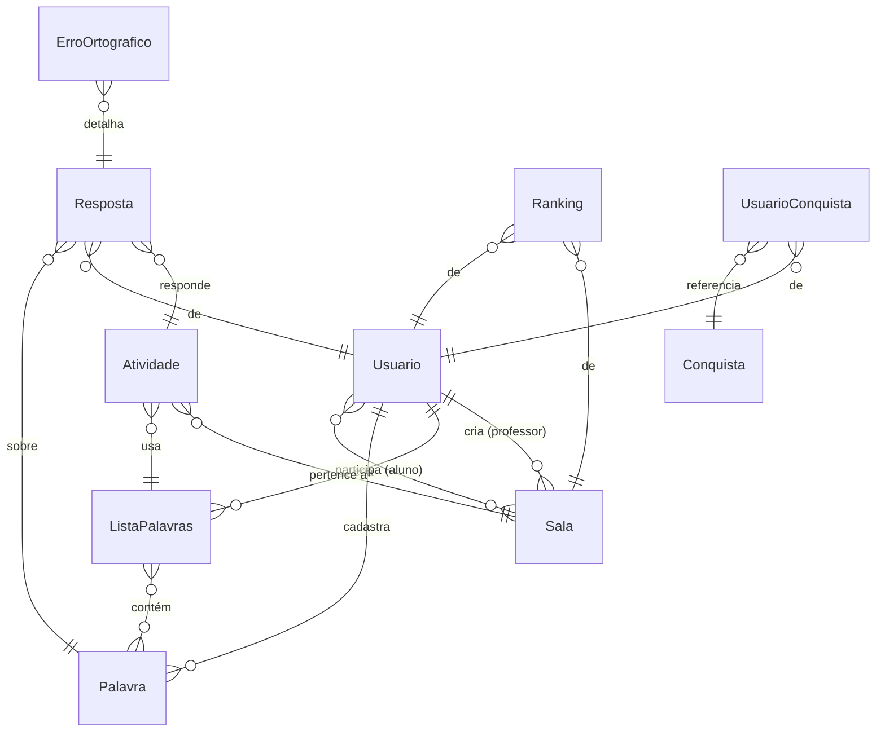

<div align="center">

# DIGITADO

**Plataforma gamificada de ditado ortográfico em tempo real.**
Ouça a palavra, escreva a grafia correta, ganhe XP e suba no ranking — sozinho, em duelo 1v1 ou numa sala com a turma inteira.

[](https://openjdk.org/)
[](https://spring.io/projects/spring-boot)
[](https://www.jhipster.tech/)
[](https://react.dev/)
[](https://www.mysql.com/)

</div>

---

## Sobre o projeto

O **DIGITADO** é uma aplicação web full-stack pensada para o contexto escolar. Um professor cria salas de jogo, os alunos entram por um código e, em tempo real, disputam quem escreve as palavras ditadas de forma correta e mais rápida. Cada acerto rende pontos e XP, desbloqueia conquistas e movimenta o ranking mundial.

O sistema nasceu de um modelo de domínio em [JDL](DIGITADO.jdl) e foi gerado com **JHipster**, combinando um backend **Spring Boot** com um frontend **React**. A comunicação das partidas acontece por **WebSocket (STOMP/SockJS)**, garantindo placar e feedback instantâneos.

## Funcionalidades

| Recurso                 | Descrição                                                                                                                                                       |
| ----------------------- | --------------------------------------------------------------------------------------------------------------------------------------------------------------- |
| **Salas em tempo real** | O professor cria uma sala, compartilha o código, e os alunos entram e jogam juntos. Palavras avançam automaticamente com tempo por dificuldade; placar ao vivo. |
| **Duelo 1v1**           | Desafio direto entre dois jogadores.                                                                                                                            |
| **Palavra do Dia**      | Desafio público diário — uma chance por pessoa (controle no servidor por conta ou cookie). Acertar rende XP.                                                    |
| **Ranking mundial**     | Os melhores jogadores por XP acumulado, com destaque para o top 5 na home.                                                                                      |
| **Conquistas**          | Medalhas desbloqueadas conforme o desempenho, com recompensa de XP.                                                                                             |
| **Ditado por áudio**    | A palavra é falada via síntese de voz do navegador — o texto nunca aparece na tela.                                                                             |
| **Campo anti-cola**     | O input bloqueia colar, arrastar, autocompletar e correção ortográfica; só a digitação real (física ou teclado virtual) é aceita.                               |
| **Banco de palavras**   | Palavras por dificuldade, categoria e dica, com sugestões enviadas pelos jogadores.                                                                             |
| **LGPD**                | O titular pode exportar e excluir seus dados; há rotina de retenção automática.                                                                                 |
| **Observabilidade**     | Métricas Prometheus, dashboards Grafana e alertas — ver [MONITORING.md](MONITORING.md).                                                                         |

## Stack tecnológica

**Backend**

- Java 17 · Spring Boot 3.4.7 · Spring Security (JWT / OAuth2 Resource Server)
- Spring WebSocket + STOMP (broker simples `/topic` e `/queue`)
- Spring Data JPA · MySQL 9.2 · Liquibase (versionamento de schema)
- Rate limiting e Request-ID por filtros próprios

**Frontend**

- React 18 · TypeScript · React Router 7 · Redux Toolkit
- `@stomp/stompjs` + `sockjs-client` (tempo real) · Axios
- Bootstrap 5 / Reactstrap · Webpack

**Infra & Qualidade**

- Docker Compose (app + serviços) · Prometheus / Grafana / Alertmanager
- SonarQube · ESLint · Prettier · Husky (pre-commit) · Jest · JUnit + Testcontainers

## Modelo de domínio



O modelo completo, incluindo enums (`Dificuldade`, `TipoUsuario`, `StatusAtividade`, `TipoErro`…), está em [`DIGITADO.jdl`](DIGITADO.jdl).

## Segurança

Autenticação por **JWT** (stateless), com autorização baseada em papéis: `ROLE_ADMIN`, `ROLE_USER` e `ROLE_ANONYMOUS`.

- **Manipulação do banco restrita ao ADMIN.** As escritas (`POST`/`PUT`/`PATCH`/`DELETE`) das entidades administrativas — `atividades`, `palavras`, `conquistas`, `rankings`, `respostas`, `lista-palavras`, `erro-ortograficos`, `usuarios` e `usuario-conquistas` — exigem `ROLE_ADMIN`.
- **Endpoints de jogo** permanecem acessíveis a qualquer usuário autenticado: `palavras/sugerir`, `usuarios/alterar-senha`, `salas/**`, `conquistas/minhas`.
- **Endpoints públicos:** `palavra-do-dia`, `ranking-mundial`, registro e recuperação de senha.
- **Defesa em profundidade:** rate limiting configurável, `Request-Id` para rastreabilidade, validação server-side do ditado e das chances diárias, e handshake WebSocket autenticado por JWT.

As regras ficam em [`SecurityConfiguration.java`](src/main/java/br/com/digitado/config/SecurityConfiguration.java).

---

## Guia passo a passo (do zero até rodar)

Este guia parte de uma máquina sem nada instalado e termina com o back-end e o front-end rodando. Os comandos são mostrados para **Windows (PowerShell)** e, quando diferentes, para **macOS/Linux**.

### Passo 1 — Instalar as ferramentas de base

Você precisa de quatro coisas: **Git**, **JDK 17**, **Node.js (que traz o npm)** e um **MySQL** (ou Docker).

#### 1.1. Git

- Windows: baixe em <https://git-scm.com/download/win> e instale (avance com "Next" e conclua com "Finish").
- macOS: `brew install git` · Linux (Debian/Ubuntu): `sudo apt install git`

Verifique:

```bash
git --version
```

#### 1.2. JDK 17

Baixe o **Java 17** (Temurin/Adoptium é uma boa opção): <https://adoptium.net/temurin/releases/?version=17>. Instale e confirme:

```bash
java -version
```

A saída deve mostrar `17.x`. Se mostrar outra versão, ajuste a variável `JAVA_HOME` para apontar para o JDK 17.

#### 1.3. Node.js e npm

O **npm** já vem junto com o Node.js — instalar o Node instala o npm. Use a versão **22 LTS** (a testada no projeto é a `v22.15.0`).

- **Windows/macOS:** baixe o instalador LTS em <https://nodejs.org/> e execute.
- **macOS (Homebrew):** `brew install node@22`
- **Linux/macOS (recomendado, com nvm):**
  ```bash
  curl -o- https://raw.githubusercontent.com/nvm-sh/nvm/v0.40.1/install.sh | bash
  nvm install 22
  nvm use 22
  ```

Verifique as duas ferramentas:

```bash
node -v
npm -v
```

> Observação: o projeto também traz o wrapper `npmw`, que baixa e fixa a versão correta do npm automaticamente. Ainda assim, ter o Node instalado globalmente torna o passo a passo mais simples.

#### 1.4. MySQL (ou Docker)

Você tem duas opções — escolha **uma**.

- **Opção A (mais fácil): Docker.** Instale o [Docker Desktop](https://www.docker.com/products/docker-desktop/). Não precisa instalar MySQL à mão; um container é subido no Passo 4.
- **Opção B: MySQL local.** Instale o **MySQL 8+** em <https://dev.mysql.com/downloads/installer/> e deixe o serviço rodando na porta padrão `3306`.

### Passo 2 — Obter o código

```bash
git clone https://github.com/davifsrPI/DIGITADO.git
cd DIGITADO
```

### Passo 3 — Instalar as dependências do frontend

Na raiz do projeto, baixe as dependências do npm (só é necessário na primeira vez e sempre que o `package.json` mudar):

```bash
npm install
```

Alternativa com o wrapper (fixa a versão do npm):

- Windows (PowerShell): `.\npmw.cmd install`
- macOS/Linux: `./npmw install`

### Passo 4 — Preparar o banco de dados

**Se escolheu Docker (Opção A):** suba o MySQL em container:

```bash
docker compose -f src/main/docker/mysql.yml up -d
```

**Se escolheu MySQL local (Opção B):** o perfil de desenvolvimento cria o schema `DIGITADO` automaticamente e, por padrão, conecta com usuário `root` / senha `31415` (definido em [`application-dev.yml`](src/main/resources/config/application-dev.yml)). Para usar outras credenciais, defina variáveis de ambiente **antes** de subir o back-end:

- Windows (PowerShell):
  ```powershell
  $env:SPRING_DATASOURCE_USERNAME = "root"
  $env:SPRING_DATASOURCE_PASSWORD = "suaSenha"
  ```
- macOS/Linux:
  ```bash
  export SPRING_DATASOURCE_USERNAME=root
  export SPRING_DATASOURCE_PASSWORD=suaSenha
  ```

### Passo 5 — Rodar o back-end (Spring Boot)

Em um terminal, na raiz do projeto:

- Windows (PowerShell): `.\mvnw.cmd`
- macOS/Linux: `./mvnw`

Na primeira execução o Maven baixa as dependências (pode levar alguns minutos). O back-end está pronto quando aparecer no log:

```
Application 'DIGITADO' is running! Access URLs:
    Local:    http://localhost:8080/
```

Deixe **este terminal aberto** — ele mantém a API rodando na porta **8080**.

### Passo 6 — Rodar o front-end (React)

Abra um **segundo terminal** (sem fechar o do back-end), na raiz do projeto:

- Windows (PowerShell): `.\npmw.cmd start`
- macOS/Linux: `./npmw start` (ou simplesmente `npm start`)

O webpack compila e abre o navegador em **<http://localhost:9000>**, com hot-reload (a página recarrega sozinha ao salvar arquivos). O front-end faz proxy das chamadas `/api` para o back-end na 8080.

### Passo 7 — Acessar e entrar

Abra <http://localhost:9000> e faça login com uma das contas de desenvolvimento já cadastradas:

| Usuário | Senha   | Papel      |
| ------- | ------- | ---------- |
| `admin` | `admin` | ROLE_ADMIN |
| `user`  | `user`  | ROLE_USER  |

Pronto — você pode criar uma sala, jogar a Palavra do Dia e explorar o ranking.

### Resumo dos comandos

```bash
# 1. clonar
git clone https://github.com/davifsrPI/DIGITADO.git
cd DIGITADO

# 2. dependências do front
npm install

# 3. banco (via Docker)
docker compose -f src/main/docker/mysql.yml up -d

# 4. back-end (terminal 1)   ->  http://localhost:8080
./mvnw            # Windows: .\mvnw.cmd

# 5. front-end (terminal 2)  ->  http://localhost:9000
npm start         # ou ./npmw start  (Windows: .\npmw.cmd start)
```

---

## Build de produção

```bash
./mvnw -Pprod clean verify
```

Gera um jar único com o front-end minificado embutido. Para executar:

```bash
java -jar target/*.jar
```

Acesse <http://localhost:8080>. Em produção, informe o segredo JWT e as credenciais do banco por variáveis de ambiente.

## Testes

```bash
# Testes de backend (JUnit + Testcontainers)
./mvnw verify
```

```bash
# Testes de frontend (Jest)
./npmw test
```

## Estrutura do projeto

```
DIGITADO/
├── src/main/java/br/com/digitado/
│   ├── config/            # Segurança, WebSocket, propriedades da aplicação
│   ├── domain/            # Entidades JPA e enums
│   ├── service/           # Regras de jogo, XP, conquistas, palavra do dia, LGPD
│   ├── web/rest/          # Controladores REST (API)
│   ├── web/websocket/     # Endpoints STOMP das salas
│   └── web/filter/        # Rate limit, Request-Id, SPA
├── src/main/webapp/app/
│   ├── modules/           # Telas de jogo (sala, duelo, lobby, ranking, conquistas…)
│   ├── entities/          # CRUDs administrativos
│   └── shared/            # Componentes e utilitários (ex.: campo anti-cola)
├── src/main/resources/config/liquibase/   # Migrações de schema
├── src/main/docker/       # Compose: app, MySQL, monitoramento, Sonar
└── DIGITADO.jdl           # Modelo de domínio
```

## Monitoramento

Stack de observabilidade com Prometheus, Grafana e Alertmanager. Consulte **[MONITORING.md](MONITORING.md)** para subir e configurar. Para iniciar os serviços:

```bash
docker compose -f src/main/docker/monitoring.yml up -d
```

## LGPD

O DIGITADO trata dados pessoais conforme a LGPD: o titular pode **exportar** (`GET /api/account/export`) e **excluir** (`DELETE /api/account`) seus dados, e um job agendado **anonimiza automaticamente** as tentativas antigas (retenção mínima de dados).

## Contribuindo

Os hooks de pre-commit (Husky) rodam Prettier e lint automaticamente. Mantenha os testes verdes (`./mvnw verify` e `./npmw test`) antes de abrir um PR.

---

<div align="center">
DIGITADO © 2026 — gerado com <a href="https://www.jhipster.tech/">JHipster 8.11.0</a>
</div>
